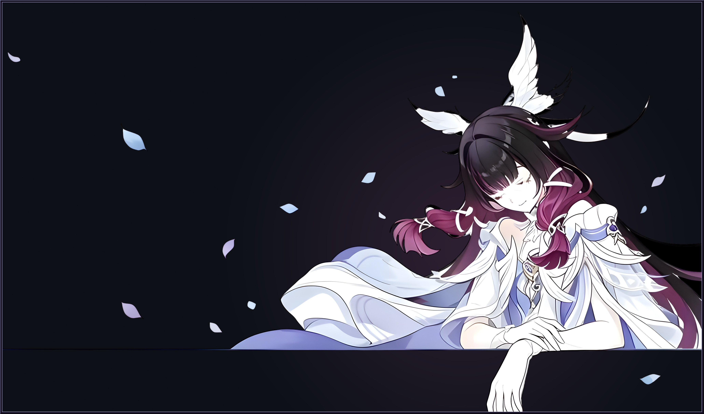
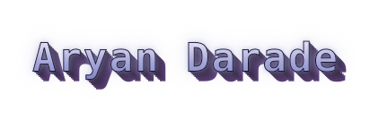
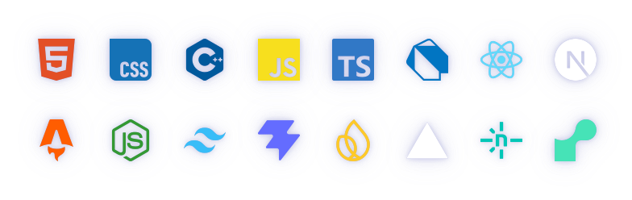

 

- currently in my **last year of a CS Diploma**
- I play games more than I probably should admit
- I build things that catch my interest, nothing more calculated than that
- always poking at some new tool or stack just to see what it does
- some of my favorite projects started as "let me just try this"

 

 

 

